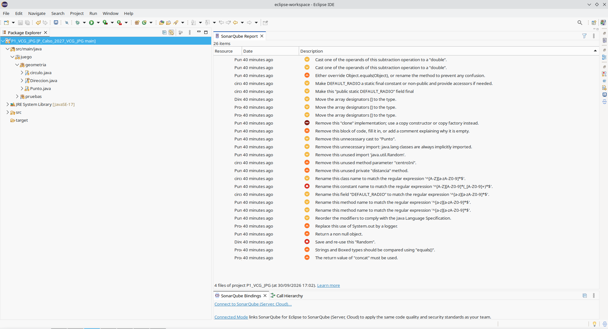

# Práctica 1 — Revisiones estáticas de código con SonarQube for Eclipse

## 1. Miembros del grupo

| Miembro | Nombre y apellidos |
|---|---|
| Alumno/a 1 | Victor Carrillo Gil |
| Alumno/a 2 | Javier Peñalver Gómez |

**Nombre del proyecto Eclipse:** `P1_VCG_JPG`

---

## 2. Análisis inicial

Antes de realizar ninguna modificación sobre el código proporcionado se ha ejecutado el análisis estático del proyecto utilizando **SonarQube for Eclipse** con su configuración por defecto.

### Captura inicial



---

## 3. Disconformidades detectadas

En el análisis inicial se han identificado las siguientes disconformidades:

| Nº | Regla Sonar | Archivo | Línea | Disconformidad |
|---:|---|---|---:|---|
| 1 | `java:SXXXX` | `Clase.java` | XX | Descripción de la disconformidad |
| 2 | `java:SXXXX` | `Clase.java` | XX | Descripción de la disconformidad |
| 3 | `java:SXXXX` | `Clase.java` | XX | Descripción de la disconformidad |

> Deben incluirse **todas las disconformidades observadas en el análisis inicial**.

---

## 4. Soluciones adoptadas

### Disconformidad 1 — `java:SXXXX`

**Localización:** `src/.../Clase.java`, línea XX  
**Responsable:** NOMBRE Y APELLIDOS  
**Commit:** `abcdef1`

**Problema detectado**

Descripción breve del problema indicado por SonarQube for Eclipse.

**Solución adoptada**

Descripción de la modificación realizada para resolver la disconformidad.

---

### Disconformidad 2 — `java:SXXXX`

**Localización:** `src/.../Clase.java`, línea XX  
**Responsable:** NOMBRE Y APELLIDOS  
**Commit:** `abcdef2`

**Problema detectado**

Descripción breve del problema indicado por SonarQube for Eclipse.

**Solución adoptada**

Descripción de la modificación realizada para resolver la disconformidad.

---

### Disconformidad 3 — `java:SXXXX`

**Localización:** `src/.../Clase.java`, línea XX  
**Responsable:** NOMBRE Y APELLIDOS  
**Commit:** `abcdef3`

**Problema detectado**

Descripción breve del problema indicado por SonarQube for Eclipse.

**Solución adoptada**

Descripción de la modificación realizada para resolver la disconformidad.

---

## 5. Resumen de las correcciones

| Nº | Regla Sonar | Responsable | Commit | Resultado |
|---:|---|---|---|---|
| 1 | `java:SXXXX` | Nombre y apellidos | `abcdef1` | Resuelta |
| 2 | `java:SXXXX` | Nombre y apellidos | `abcdef2` | Resuelta |
| 3 | `java:SXXXX` | Nombre y apellidos | `abcdef3` | Resuelta |

---

## 6. Análisis final

Una vez realizadas todas las modificaciones se ha vuelto a ejecutar el análisis del proyecto completo con **SonarQube for Eclipse**.

### Captura final


La captura final permite comprobar que se está analizando el mismo proyecto utilizado en la captura inicial y que ya no quedan disconformidades pendientes.

---

## 7. Proyecto final

La versión final del proyecto Eclipse se encuentra en:

```text
P1/proyecto/P1_VCG_JPG/
```

El proyecto incluido en esta carpeta contiene las modificaciones correspondientes a las soluciones documentadas anteriormente y coincide con la versión sobre la que se ha realizado la captura final.

---

## 8. Comprobación de la entrega

- [ ] El nombre del proyecto sigue el formato establecido: `P1_INICIALES`.
- [ ] Se identifican los dos miembros del grupo.
- [ ] Se incluye la captura del análisis inicial.
- [ ] Se han documentado todas las disconformidades inicialmente detectadas.
- [ ] Cada solución está asociada a un commit identificable en `main`.
- [ ] Se identifica qué miembro del grupo realizó cada corrección.
- [ ] Los dos miembros han participado mediante commits propios.
- [ ] Se incluye la captura del análisis final.
- [ ] La captura final permite comprobar que no quedan disconformidades.
- [ ] Se ha incorporado el proyecto Eclipse final dentro de `P1/proyecto/`.
- [ ] El proyecto final corresponde al código analizado en la captura final.
